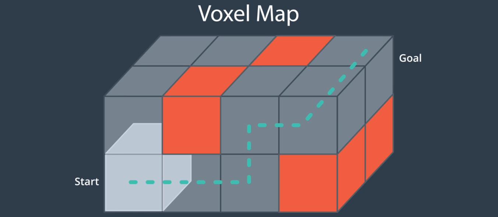

# AAE_Notebook_011_VoxelMap
In this notebook, we look at implementing a 3D Voxel Map of our environment.

Up to this point, we've looked at several methods to solved the path-planning problem of AAVs; however, we've only been working in 2D. Now we're going to start looking at how to solve the path-planning problem for a 3D vehicle in a 3D environment.

As with the 2D implementations, we still need the following: a state space, an action space, a cost function, and a start and goal state. To get to the state space, we need to represent not only the environmental geometry in 3D but, also, the configuration space. Depending on the representation you choose, some tasks may become easier and others, harder.

As we move into 3D space, computation becomes more complex and costly; thus, over the course of our planning, we may need to make certain trade-offs.

Looking back at previous approaches, we've mainly used a grid-based approach. We can use such an approach with 3D as well; however, rather than working at a pixel (picture element) level, we must now contend with [voxels](https://en.wikipedia.org/wiki/Voxel) (volume elements).

Note that we are still able to represent unfeasible areas within our environment (orange), free space (grey), a start, and a goal.
